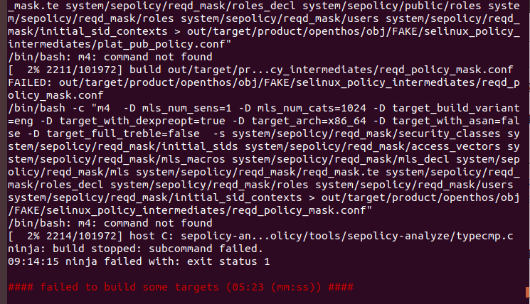
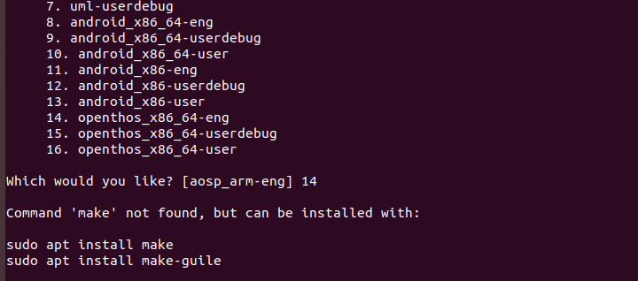

# OPENTHOS 8.1系统开发环境设置（基于Ｕbuntu18.04 LTS)

本文旨在提供一个在Ubuntu18.04下设置OPENTHOS8.1系统级编译环境的说明，以供有关工程师参考。

## 开发环境要求
要编译OPENTHOS8.1系统，需要满足一定的软硬件要求。下面将分别予以说明。

### 硬件要求

您的开发工作站必须达到或超出以下硬件要求：
* 64位双核以上X86_64 CPU，单核CPU也可以凑合编译，但编译时间极慢，建议5代i5以上。  
* 系统支持现代UEFI
* 硬盘空间  
   单纯下载代码用于查看需要至少50GB的可用磁盘空间；  
   如果是进行单次编译，需要至少175GB的可用磁盘空间；  
   如果是进行多次编译，需要200GB的可用磁盘空间。  
   如果您使用 ccache，则需要更多空间。  
* RAM, 2GB以上。建议16GB以上，对于内存不足16GB的，需要设置足够大的SWAP空间，这就意味着对于系统而言需要更大的硬盘空间。  
在我本人的实际环境搭建测试过程中发现，240GB的SSD在安装Ubuntu系统并开启足够的SWAP空间后，剩余空间约192GB,考虑到ext4文件系统需要保留5%以上的空间。实际可用空间不足180GB，仅能勉强完成一次编译，且编译后期非常缓慢。因此如何使用SSD，建议使用480GB以上产品。  
### 软件要求
Ubuntu 16.04或Ubuntu18.04，本例中我们仅以Ubuntu18.04为例进行介绍。  
其他版本的Ubuntu系统或是其它Linux发行版可能能满足开发的要求，但这些都不在本文的论述范围之内。  

## 系统安装及环境设置

###　Ubuntu18.04操作系统安装  
建议以UEFI的模式安装Ubuntu18.04。  
刻录Ubuntu18.04系统安装光盘或是生成安装U盘的方法以及Ubuntu18.04的安装过程，不在本文的介绍范围内，请自行通过搜索引擎查找相关信息。　　
建议安装过程中选择手动安装，并为系统配置一个16GB的SWAP分区。当然如果对Linux分区的概念不熟悉，也可以选择自动的方式进行安装，待安装完成后再创建一个SWAP文件。  
###*创建并启用swap文件(可选操作）*  
***注意***  
*如果您的系统的内存比较小，且未分配足够的内存，则在编译的过程中可能遇到如下的报错*  
  
这种情况通常出现在内存较小的机器上，OPENTHOS在编译过程中需要使用大量的内存空间来加快编译的速度，当内存耗尽时就会出现上图的报错。这时我们需要创建一个SWAP文件并通过此文件来充当交换分区来弥补内存不足的问题。方法如下：  
１. 创建一个SWAP文件
```bash
sudo dd if=/dev/zero of=/.16GB.swap
sudo chmod 600 /.16GB.swap
```  
2. 格式化SWAP文件
```bash
sudo mkswap /.16GB.swap
```  
３. 激活SWAP文件
```bash
sudo swapon /.16GB.swap
```  
４. 永久性启用SWAP文件  
按前３步激活的SWAP空间，在每次系统重启后都需要激活才能使用。如果希望永久性启用该SWAP文件，则需要将其添加的fstab中，让系统在启动时自动激活该SWAP空间。方法如下：
```bash
sudo echo '/.16GB.swap 　none  swap  sw  0 0' > /etc/fstab
```

### 环境设置
要在Ubuntu18.04正确编译，你需要安装如下软件包：
curl repo git m4 make lib32stdc++(或是g++-multilib) python python-mako openjdk-8-jdk zlig1g-dev libelf-dev libssl-dev 
其中受限于网络管控，repo无法直接通过apt安装，其余的软件包均可通过apt在线安装。方法是：  
```bash
sudo apt update
sudo apt install curl  git m4 make g++-multilib \
        python python-mako openjdk-8-jdk zlig1g-dev \
        libelf-dev libssl-dev 
```
#### 安装repo  
可以先进行如下的尝试:  
```bash
mkdir ~/bin
PATH=~/bin:$PATH
curl https://storage.googleapis.com/git-repo-downloads/repo > ~/bin/repo
chmod a+x ~/bin/repo
```  
不过通常与直接从apt安装repo一样，我们在受管控的网络环境中也很难从googleapis.com下载repo。因此我们可以从中科大的服务器借用一个他们mirror回来的repo。将上面的指令改成下面这样即可  
```bash
mkdir ~/bin
PATH=~/bin:$PATH
curl -sSL  'https://gerrit-googlesource.proxy.ustclug.org/git-repo/+/master/repo?format=TEXT' |base64 -d > ~/bin/repo
chmod a+x ~/bin/repo
```  
repo的运行过程中会尝试访问官方的git源更新自己，如果遇到提示无法连接到 gerrit.googlesource.com。则可改用中科大的镜像源进行更新，在你的~/.bashrc文件的最后加上一行如下的内容即可。
```
export REPO_URL='https://gerrit-googlesource.proxy.ustclug.org/git-repo'
```
***永久性设置PATH环境***  
前面的说明中设置的PATH环境，只是一次性有效。在某些非以自动方式安装Ubuntu系统的主机上，当“终端”程序被关闭重启后，您可能需要再一次设置PATH才能继续使用repo。  
检查您的~/.profile文件的最后部分是否有如下几行的内容：  
```
# set PATH so it includes user's private bin if it exists
if [ -d "$HOME/bin" ] ; then
    PATH="$HOME/bin:$PATH"
fi
```  
如果没有，则在~/.profile文件的最后加上这几行内容即可为当前用户永久性设置上相应的PATH环境变量。  
#### 关于各软件包的说明
**M4**  
在16.04以前，该软件包在build-essential包安装时，将一并安装。而在Ubuntu18.04环境中，m4不再包含于build-essential软件包中，如果不单独安装该软件包，在编译OPENTHOS的过程中将会遇到`/bin/bash: m4: command not found`的问题：  
  
**make**  
在16.04以前，该软件包在build-essential包安装时，将一并安装。而在Ubuntu18.04环境中，make不再包含于build-essential软件包中，如果不单独安装该软件包，在编译OPENTHOS的过程中将会遇到`Command 'make' not found`的问题：  
  
