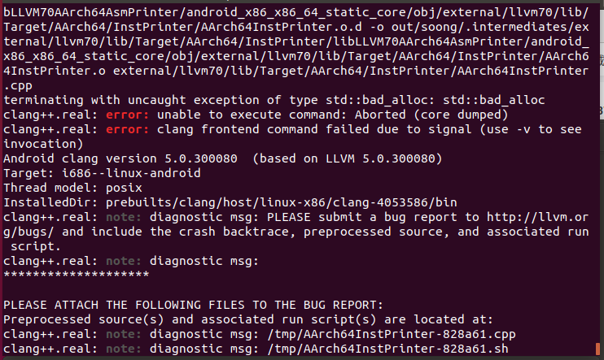

# OPENTHOS 8.1系统开发环境设置（基于Ｕbuntu18.04 LTS)

本文旨在提供一个在Ubuntu18.04下设置OPENTHOS8.1系统级编译环境的说明，以供有关工程师参考。

## 开发环境要求
要编译OPENTHOS8.1系统，需要满足一定的软硬件要求。下面将分别予以说明。

### 硬件要求

您的开发工作站必须达到或超出以下硬件要求：
* 64位双核以上X86_64 CPU，单核CPU也可以凑合编译，但编译时间极慢，建议5代i5以上。  
* 系统支持现代UEFI
* 硬盘空间  
   单纯下载代码用于查看需要至少50GB的可用磁盘空间；  
   如果是进行单次编译，需要至少175GB的可用磁盘空间；  
   如果是进行多次编译，需要200GB的可用磁盘空间。  
   如果您使用 ccache，则需要更多空间。  
* RAM, 2GB以上。建议16GB以上，对于内存不足16GB的，需要设置足够大的SWAP空间，这就意味着对于系统而言需要更大的硬盘空间。  
在我本人的实际环境搭建测试过程中发现，240GB的SSD在安装Ubuntu系统并开启足够的SWAP空间后，剩余空间约192GB,考虑到ext4文件系统需要保留5%以上的空间。实际可用空间不足180GB，仅能勉强完成一次编译，且编译后期非常缓慢。因此如何使用SSD，建议使用480GB以上产品。  
### 软件要求
Ubuntu 16.04或Ubuntu18.04，本例中我们仅以Ubuntu18.04为例进行介绍。  
其他版本的Ubuntu系统或是其它Linux发行版可能能满足开发的要求，但这些都不在本文的论述范围之内。  

## 系统安装及环境设置

###　Ubuntu18.04操作系统安装  
建议以UEFI的模式安装Ubuntu18.04。  
刻录Ubuntu18.04系统安装光盘或是生成安装U盘的方法以及Ubuntu18.04的安装过程，不在本文的介绍范围内，请自行通过搜索引擎查找相关信息。　　
建议安装过程中选择手动安装，并为系统配置一个16GB的SWAP分区。当然如果对Linux分区的概念不熟悉，也可以选择自动的方式进行安装，待安装完成后再创建一个SWAP文件。  
***注意***  
*如果您的系统的内存比较小，且未分配足够的内存，则在编译的过程中可能遇到如下的问题*  

###*创建并启用swap文件*  
